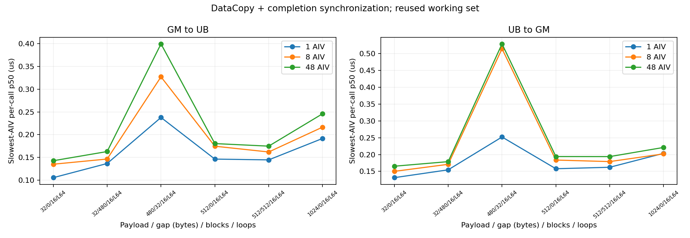
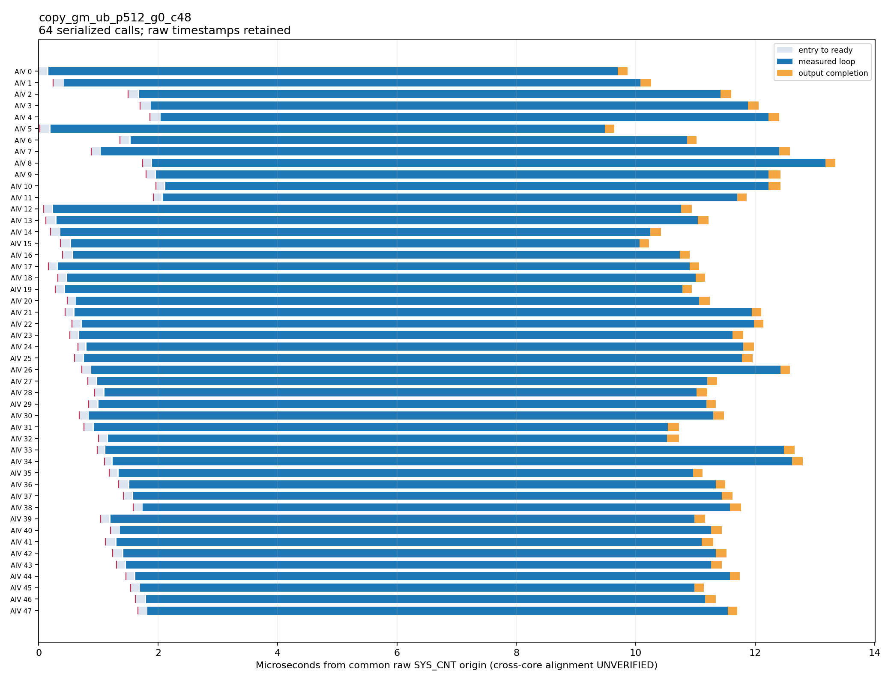
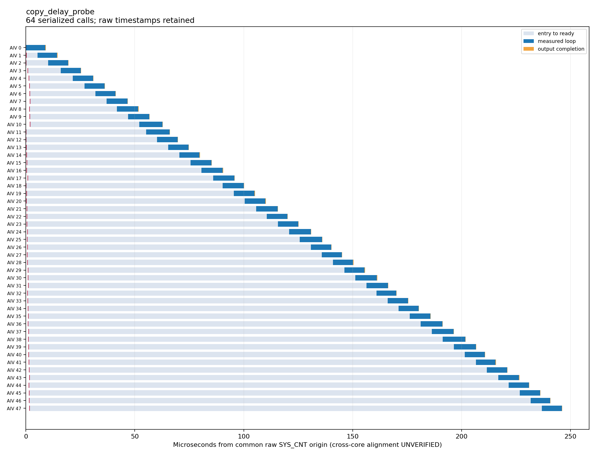
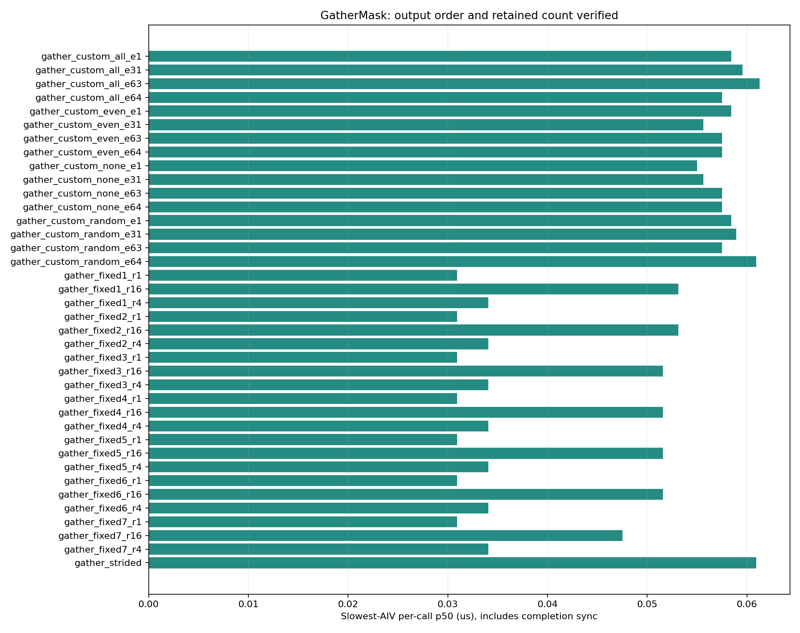

# A3 DataCopy 多AIV与 GatherMask 实测

2026-09-15，在 Ascend910_9382、CANN 9.1.0-beta.1 上完成两轮实验：**106个配置、2998次启动全部通过输出校验**。trace开启时同时校验每AIV返回的有效元素数量。另有最终冒烟15次启动通过，不计入这两个总数。

| 轮次 | 配置 | 每配置启动 | 总启动 | 统计 |
|---|---:|---:|---:|---|
| 主矩阵 | 78 | 3预热 + 10对trace/plain | 1794 | [CSV](main-summary.csv) |
| 补充对照 | 28 | 3预热 + 20对trace/plain | 1204 | [CSV](followup-summary.csv) |

## 已形成的闭环

输入与参数 → 独立Ascend C kernel → CPU oracle → 每AIV原始tick → 原始记录复核 → 统计与图片。两个kernel使用同一独立记录器，原始事件不再只剩duration。

- DataCopy：1/8/48 AIV，GM→UB及UB→GM，连续、32B/480B/512B间隔，blockCount 1/4/16/64；各核访问独立GM片段。跨步写检查gap和末尾保护区。
- GatherMask：固定模式1..7；自定义空/全选/交替/随机mask；普通/计数模式；每repeat的1/31/63/64元素；repeat 1/4/16；源步长与共享掩码步长；补充48AIV用例。
- 每次调用后同步到标量流水，再记录结束；准备、结果搬出与日志导出均在测量区间外。
- 最終离线报告重新从.npy原始记录计算并核对samples，未使用人工填写的性能数字。

## 一条可复验的发现

固定48AIV、uint32、每核16块×480B、每launch循环64次，仅改变块间gap：

| 方向 | gap=0 p50 | gap=32B p50 | 比值 |
|---|---:|---:|---:|
| GM→UB | 0.1731μs | 0.4402μs | 2.54倍 |
| UB→GM | 0.1886μs | 0.5386μs | 2.86倍 |

数值是每launch最慢AIV的批量时间/64，再对20次有效采集取p50，包含循环与完成同步。这表明本配置下32B间隔有明显代价；**尚不能仅凭该实验确定是cache line、bank或其他内部路径导致**。应用于真实算子时应保留业务布局并做端到端复验。

主矩阵概览（有效数据量也随payload变化，不能把各点视为严格单变量对照）：

## 多AIV原始时间线

记录入口、准备完成、计时起止、输出完成5个事件。每核原始tick与有效位均保留，JSON使用字符串避免64位精度损失。

受控延迟探针在准备阶段给第k个AIV增加k×250 tick（按官方50MHz换算为k×5μs）。阶梯保留下来，说明导出没有将每核首点丢弃或分别归零：

这张图使用共同原始SYS_CNT起点，**跨核时钟严格校准未完成**；不是UTC时间，也不是硬件精确启动时刻。

## GatherMask

固定模式1、单repeat、8AIV时，64次循环的每调用p50约0.03094μs；包含API及完成同步。1次调用测量受20ns计数器粒度和边界成本影响更大；补充1/8/256循环对照显示总时间增长，不能把循环平均值的小数位当成硬件纳秒级分辨率。

空掩码输出数量为0；随机掩码、输出顺序、固定模式及多repeat的有效元素数均经oracle验证。

## 证据与复现

- [环境摘要、原始manifest和源码哈希](evidence.json)
- [DataCopy原始事件](datacopy-48aiv-events.jsonl)、[逐次样本](datacopy-48aiv-samples.json)
- [48AIV GatherMask原始事件](gathermask-48aiv-events.jsonl)
- [主矩阵全表](main-report.md)、[补充全表](followup-report.md)
- [编译、运行、报告命令](../../docs/quickstart.md)

完整原始数据保留在本工作树的 `results/a3-matrix-02/` 与 `results/a3-followup-01/`，远程目录为 `/home/t00906153/ascend-kernel-lab/results/`。结果目录被Git忽略；本目录仅提交统计、精选原始事件及图。主矩阵有 `source.tar.gz`，补充实验有与当时manifest逐文件哈希一致的 `source-used.tar.gz`；`source-final.tar.gz` 仅为最终工具版本，不冒充采样时版本。

## 限制

- 单卡、uint32、重复小工作集；不声明冷缓存或多卡竞争已验证。
- 指标为串行完成耗时，包含同步，不是裸API发射延迟或异步饱和吞吐。
- Host开关对照受调度和launch噪声影响，保留负差值，不据此宣称插桩零开销。
- 逻辑block/subblock与物理核身份不混用；首点表示程序到达插桩位置。
- 完成了8项自动测试、最终上板冒烟、原始记录重算、图片检查及HTML配置切换验证。任意业务事件表和生产环境集成仍需适配。
