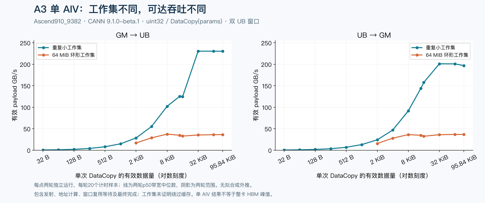
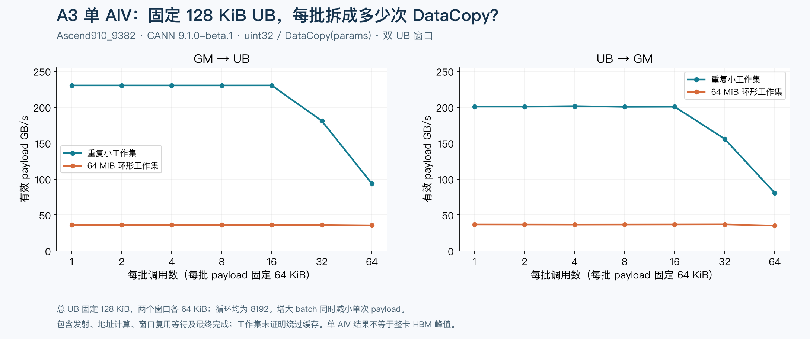

# A3 DataCopy：从未触顶的10点扫描到可复测的平台

**这次测到了指定条件下的稳定平台。** 单AIV、uint32、DataCopy(params)、两个独立UB窗口：重复小工作集的GM→UB约230.4GB/s、UB→GM约200GB/s；64MiB环形工作集两个方向约36～37GB/s。旧图的116/111GB/s不是能力上限。这里是单AIV的有效搬运吞吐，不能称为整卡HBM峰值，也不能代替A5结果。



## 哪些条件得到了验证

环境：Ascend910_9382，CANN 9.1.0-beta.1，dav-2201，GetSystemCycle=50MHz。设备报告48个AIV，本实验只启动1个；UB容量来自同版本SoC配置，为196608B，扣除320B记录器空间后规划各窗口。运行前后整机NPU进程表为空；快照不能排除期间短暂干扰。

| 测量模式 | 每次数据量/末端范围 | GM→UB | UB→GM | 解释 |
|---|---|---:|---:|---|
| 小工作集、每批完成、batch=1、8192循环 | 191.69KiB | 196.47～198.84GB/s | 169.03～169.16GB/s | 比原32KiB结果高，但不能据此称为持续流水上限 |
| 小工作集、双窗口、batch=1、8192循环 | 32～95.84KiB | 约230.4GB/s | 约197～202GB/s | 两轮末端均进入平台；32KiB以上继续放大没有持续增益 |
| 64MiB环、每批完成、batch=1 | 64～191.69KiB | 约34～36GB/s | 约33～36GB/s | 末端三点通过预设平台候选检查 |
| 64MiB环、双窗口、batch=1、至少8192循环 | 32～95.84KiB | 约35～36.5GB/s | 约36～37GB/s | 加大窗口后仍在相近平台；没有证明工作集绕过缓存 |

双窗口在复用某个UB窗口前等待该窗口的旧DMA完成，同时另一个窗口可以在途；计时结束前等待两个窗口全部完成。计时包含循环、地址计算、提交、复用等待和最终排空，不扣空循环。p50/p95是多次launch中“整段时间/调用数”的分布，不是独立请求的尾延迟。

## 同样的UB容量，batch越大并不总是越快



图中总UB固定128KiB、每个窗口64KiB、loops=8192；改变batch时，单次payload相应缩小。GM→UB在batch=1/2/4/8/16附近均可到约230.4GB/s，进一步拆成小调用反而下降。小调用的发射/地址/同步成本不能靠无限加batch消除；这张图不等于改变AIV数的整卡扩展实验。

64MiB环的曲线存在局部起伏，全部保留，没有拟合成S形。平台筛选采用预先定义的规则：末端3个尺寸跨度至少2倍，两轮所有末端带宽差异≤10%，各点p95/p50≤1.10。它是经验筛选规则，不能独立证明理论最优。

## 测了多少，哪些结果不能混用

本轮478个性能配置，各跑两轮，每轮3次预热、20次计时与20次无计时对照，共41108次launch；另122个边界/容量/类型/同步冒烟配置，共854次launch。**合计41962次launch，输出与保护区检查均通过。** 性能图对应19120条原始计时样本。

性能扫描均为uint32/DataCopy(params)。冒烟另覆盖count/params/Pad三种重载、uint32/float16/bfloat16/float32/uint8五种dtype，以及双窗口奇偶循环、环形回绕、偏移、跨步和控制路径；这不等于所有dtype均做了吞吐扫描。

首轮128循环的小工作集采样出现明显波动，已完整保留在CSV。把计时窗口延长到8192循环后，大shape两轮结果稳定；不能将波动归因于某个硬件机制，因为本轮没有相应计数器证据。平台图使用明确标注的双窗口长计时配置，不删除首轮慢样本。

实际算子中，逐次等待的调用应匹配每次/每批完成基准；可以独立流水的调用才匹配双窗口基准。先用[DeepEP #43](https://gitcode.com/ChenDonYY/ascend_deepep/merge_requests/43)采集真实dtype、shape和调用数，再在A5同环境复测。不能直接用230GB/s给复合TokenCopyToBuffer阶段填写理想时间。

## 证据与复现

[points.csv](points.csv)保存956个配置轮次、每点20个完整区间tick及真实参数；[coverage.json](coverage.json)保存13个run的计数和manifest/内核/动态库哈希。完整机器日志和原始目录留在未提交的results中。每点由全部计时样本计算，所有图均无外推。

```bash
# 独立重画，不需要NPU；要求numpy、matplotlib及中文字体。
python3 reports/datacopy-a3-capacity/plot.py
# 从本轮完整原始目录再次核对并导出；需要AKL #33的Python模块。
PYTHONPATH=python python3 reports/datacopy-a3-capacity/extract.py /path/to/raw/results
```

具体上机命令见[扫描步骤](../datacopy-a3-ten-points/throughput-scan.md)。设置`--windows 1 --min-loops 8192`测每批完成，设置`--windows 2 --min-loops 8192`测双窗口，分别生成small/ring计划、先冒烟、再各跑两轮。当前A3结果验证的是单卡单AIV本地GM；A5由用户在内网手动测量，按[A5回传步骤](../datacopy-a3-ten-points/a5-testing.md)发送小于5MB的ZIP。
