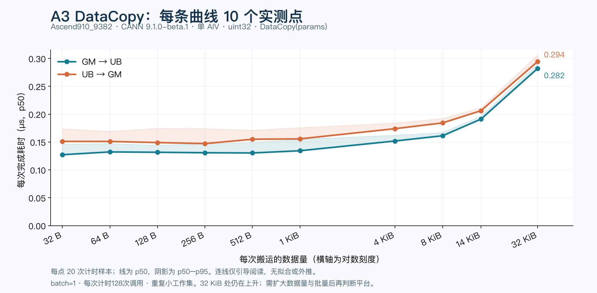
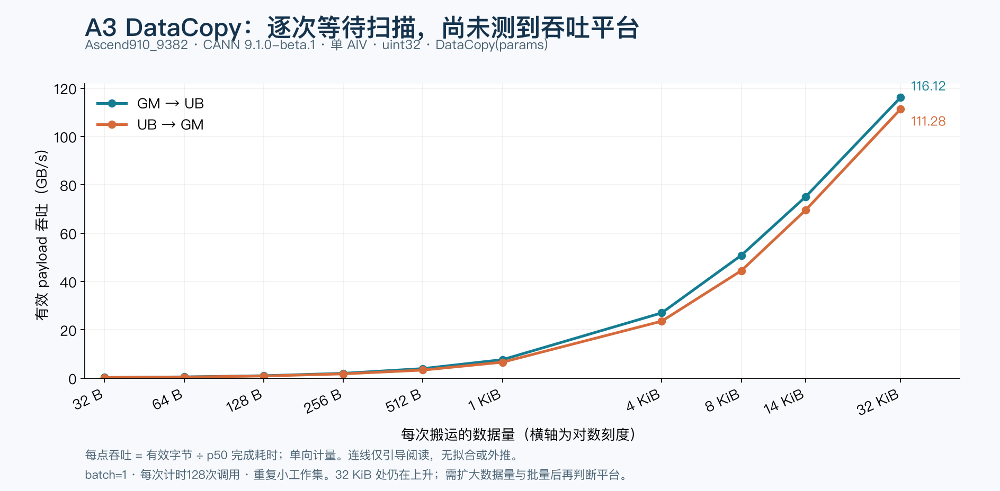

# A3 DataCopy：10 个 shape 的实测曲线

配套 [AKL #33](https://github.com/Kirrito-k423/ascend-kernel-lab/pull/33)，仅重算已有 NPU 实测数据，本次没有新跑设备。

**尚未测到吞吐平台。** 下面是逐次等待完成的延迟扫描；到32KiB时带宽仍明显增长，116.12/111.28GB/s只能称为此扫描已测的最高值。吞吐上限必须继续扩大单次数据量、每批调用数，并区分工作集。[扩展扫描与平台检查步骤](throughput-scan.md)已提供，新增大容量配置仍待空闲设备实测。

## 到底测了多少个 shape

shape 按 **每段字节数、段数、段间 gap** 去重，共 **18 种布局**：15种单段长度（4～32768B），加3种跨步布局（32B×16、gap=480B；480B×16、gap=32B；480B×31、gap=32B）。再考虑dtype，覆盖21种dtype+布局组合。

改变API重载、方向、dtype、batch、循环数和工作集后，共 **168个搬运配置 + 16个空循环/同步对照 = 184配置**。每配置3次预热、20次带计时与20次不带计时的执行，共7912次launch；性能统计使用每配置全部20次有效计时样本。环境为Ascend910_9382、CANN 9.1.0-beta.1、dav-2201，单AIV、本地GM。

## 10点结果

固定uint32、DataCopy(params)、batch=1、slots=1、loops=128，选32B～32KiB的10种长度，每方向10点。每点由20个原始tick样本重算p50/p95；共复核400条计时样本。连线只用于阅读，不拟合或外推。





| 有效字节/次 | GM→UB p50 μs | UB→GM p50 μs | GM→UB GB/s | UB→GM GB/s |
|---:|---:|---:|---:|---:|
| 32 | 0.12727 | 0.15117 | 0.25 | 0.21 |
| 64 | 0.13227 | 0.15102 | 0.48 | 0.42 |
| 128 | 0.13164 | 0.14906 | 0.97 | 0.86 |
| 256 | 0.13078 | 0.14719 | 1.96 | 1.74 |
| 512 | 0.13039 | 0.15500 | 3.93 | 3.30 |
| 1024 | 0.13438 | 0.15570 | 7.62 | 6.58 |
| 4096 | 0.15188 | 0.17398 | 26.97 | 23.54 |
| 8192 | 0.16125 | 0.18430 | 50.80 | 44.45 |
| 14336 | 0.19109 | 0.20625 | 75.02 | 69.51 |
| 32768 | 0.28219 | 0.29445 | 116.12 | 111.28 |

小shape在本配置下约0.13～0.16μs；32KiB分别为0.28219/0.29445μs、116.12/111.28GB/s。这里每次拷贝都等待完成，且重复访问小工作集，包含循环和同步开销；尚未观察到平台，不是HBM物理峰值，也不是A5预期值。

[points.csv](points.csv) 保留20个点的统计值及每点全部20个原始区间tick；[coverage.json](coverage.json) 保留计数定义、环境及两次run的manifest/库哈希。完整设备日志、输出和源码快照仍在原实验归档，不在这里公开。

重画（需要numpy、matplotlib和中文字体）：

```bash
python3 reports/datacopy-a3-ten-points/plot.py
```

从原始run重新提取（需要AKL #33的Python模块以及含matrix-01/followup-01的原始目录）：

```bash
PYTHONPATH=python python3 reports/datacopy-a3-ten-points/extract.py /path/to/raw-runs
```

[A5测试步骤](a5-testing.md)。A5结果仍待目标机编译、正确性和采样验证。
